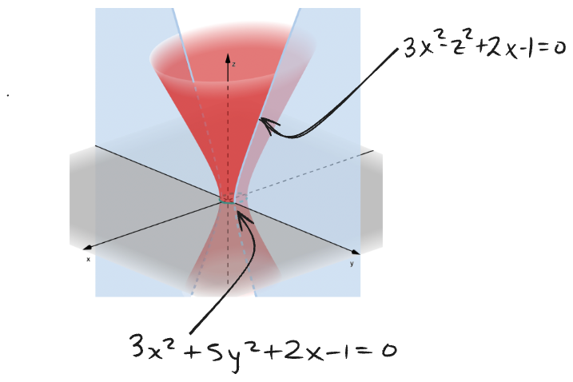

Una **superficie cuádrica** es la determinada por una ecuación de la forma
$Ax^2 + By^2 + Cz^2 + Dxy + Exz + Fyz + Gx + Hy + Iz + J = 0$,
donde al menos un término cuadrático tiene coeficiente distinto de cero.

---
**Ejemplo.**  
La ecuación
$3x^2 + 5y^2 - z^2 + 2x - 1 = 0$
define una superficie cuádrica.

Notemos que, si intersectamos una superficie cuádrica con planos coordenados, obtenemos **cónicas**.

Por ejemplo:
- Si $x=0$, se obtiene la ecuación  $5y^2 - z^2 - 1 = 0$ la cual es una hipérbola en el plano $YZ$.
- Si $y=0$, se obtiene la ecuación $3x^2  - z^2 + 2x - 1 = 0$, otra hipérbola, ahora en el plano $XZ$. 
- Si $z=0$, se obtiene una elipse en el plano $XY$. (Compruébalo)

---
**Definición.**  
Una **traza** de una cuádrica es la curva que se forma por la intersección de la cuádrica con un plano.

## 1.1 Cilindros

**Ejemplo.**  
Consideremos la ecuación
$\dfrac{x^2}{9} + \dfrac{y^2}{4} = 1$.

Esta ecuación define un **cilindro elíptico**, cuyas generatrices son paralelas al eje $z$.

**Definición.**  
Un **cilindro** es la superficie formada por rectas paralelas, cada una de las cuales contiene un punto de una curva plana llamada **directriz** del cilindro.  
Cada una de estas rectas se llama una **generatriz** del cilindro.

**Ejemplo.**  
(Ver dibujo del cilindro con sus generatrices.)

Otro ejemplo importante es el cilindro definido por la ecuación  
$x^2 = 4z$.

**Definición.**  
Diremos que un cilindro es **elíptico**, **parabólico** o **hiperbólico** si su directriz es, respectivamente, una elipse, una parábola o una hipérbola.

Hay también **casos degenerados** de cilindros.

Por ejemplo:
- $(y-2)^2 + (z+2)^2 = 0$  
  (la directriz se reduce a un punto),
- $(z-3)^2 = 0$,
- $x^2 - z^2 = 0$.

(Ver dibujos de los casos degenerados.)

Otro ejemplo de cilindro degenerado es
$x^2 - 1 = 0$.

---

En consecuencia, tenemos **siete tipos de cilindros con directriz cuádrica**:
- cilindros elípticos,
- cilindros parabólicos,
- cilindros hiperbólicos,
- un plano,
- dos planos paralelos,
- dos planos que se cortan,
- una recta.

---

**Ejercicios.**

a) Dibuja los cilindros cuya directriz está dada por las ecuaciones:
- $x^2 = y$,
- $(x+4)^2 = 4$.

b) A partir de la ecuación del cilindro, determina el tipo de directriz:
- cilindro hiperbólico con hipérbola contenida en el plano $yz$.

## 1.2 Superficies de revolución

**Definición.**  
Una **superficie de revolución** es la superficie obtenida al rotar una **curva plana**, llamada **generatriz**, en torno a una recta contenida en el mismo plano, llamada **eje**.

(Ver dibujos de la curva generatriz y el eje de rotación.)

A las distintas posiciones de la curva generatriz se les llama **meridianos**.  
A las circunferencias obtenidas a partir de cada punto de la curva generatriz las llamamos **paralelos**.

---

### Ejemplo

Consideremos la curva  
$z = y^2$.

(Ver dibujo de la parábola en el plano $yz$ y su rotación alrededor del eje $z$.)

Si fijamos $z = z_0$, entonces
$x^2 + y^2 = y_0^2$,

y como $z_0 = y_0^2$, se obtiene
$x^2 + y^2 = z$.

Por lo tanto, la superficie de revolución asociada está dada por la ecuación
$z = x^2 + y^2$.

(Ver dibujo del paraboloide.)

---

### Caso general

Sea una curva generatriz dada implícitamente por una ecuación
$f(y, z) = 0$.

Al fijar $z = z_0$, se obtiene
$x^2 + y^2 = y_0^2$,

lo que implica
$y_0 = \pm \sqrt{x^2 + y^2}$.

Sustituyendo en la ecuación de la generatriz, se obtiene
$f\bigl(\pm \sqrt{x^2 + y^2},\, z\bigr) = 0$.

En consecuencia, **para obtener la ecuación de la superficie de revolución** hay que hacer el cambio
$y \mapsto \pm \sqrt{x^2 + y^2}$.

### Resumen: superficies de revolución

En resumen, para obtener la ecuación de la superficie obtenida al girar una curva $C$ contenida en un plano alrededor de un eje dado, se realiza la sustitución correspondiente.

- **Eje $X$**:  
  $y$ o $z \;\longmapsto\; \pm\sqrt{y^2+z^2}$

- **Eje $Y$**:  
  $x$ o $z \;\longmapsto\; \pm\sqrt{x^2+z^2}$

- **Eje $Z$**:  
  $x$ o $y \;\longmapsto\; \pm\sqrt{x^2+y^2}$

---

### Ejemplo (elipsoides)

Hallar la ecuación de la superficie obtenida al rotar la elipse
$$
\frac{x^2}{9}+\frac{y^2}{4}=1
$$
alrededor del eje $X$.

Al rotar alrededor del eje $X$, la coordenada $x$ permanece fija y se sustituye
$$
y \;\longmapsto\; \pm\sqrt{y^2+z^2}.
$$

Sustituyendo en la ecuación de la elipse se obtiene
$$
\frac{x^2}{9}+\frac{(\pm\sqrt{y^2+z^2})^2}{4}=1,
$$
es decir,
$$
\frac{x^2}{9}+\frac{y^2+z^2}{4}=1
$$
y al distribuir la fracción, tenemos:
$$
\frac{x^2}{9}+\frac{y^2}{4}+\frac{z^2}{4}=1.
$$
Esta ecuación describe un **elipsoide**; en particular, un **esferoide** o **elipsoide de revolución**.

En general, una superficie de la forma
$$
\frac{x^2}{a^2}+\frac{y^2}{b^2}+\frac{z^2}{c^2}=1
$$
describe un esferoide si dos semiejes son iguales.

---

### Ejemplo (paraboloides)

Consideremos la parábola
$$
x^2=4py
$$
y giremos alrededor del eje $Y$.

En este caso se sustituye
$$
x \;\longmapsto\; \pm\sqrt{x^2+y^2}.
$$

Entonces se obtiene
$$
(\pm\sqrt{x^2+y^2})^2=4py,
$$
lo que equivale a
$$
x^2+y^2-4py=0.
$$

A la superficie obtenida la llamamos un **paraboloide de revolución**.

**Observación.** Si rotamos la parábola
$$
x^2 = 4py, \quad p>0,
$$
alrededor del eje $Y$, obtenemos

$$
x^2 = 4p\sqrt{y^2+z^2}
$$
(nótese que aquí tomamos el signo positivo de la raíz pues $x^2$ tiene que ser positivo) y al elevar al cuadrado,

$$
x^4 = 16p^2 (y^2+z^2).
$$

Por lo tanto, **la superficie obtenida no es una cuádrica**.

---

### Ejemplo (hiperboloides)

Dada la hipérbola
$$
\frac{y^2}{a^2}-\frac{z^2}{b^2}=1,
$$
obtenemos las siguientes superficies al rotarla:

La superficie obtenida se llama **hiperboloide de revolución**.

---

**Observación**. En general, un hiperboloide de revolución es de la forma
$$
\pm\frac{x^2}{a^2}\pm\frac{y^2}{b^2}\pm\frac{z^2}{c^2}=1,
$$
con **dos términos positivos y uno negativo** (o bien **dos negativos y uno positivo**), y con denominadores iguales en los términos del mismo signo.

---

### Resumen

Tenemos las siguientes superficies de revolución:

- Elipsoides de revolución  
- Paraboloides de revolución  
- Hiperboloides de revolución  

---

### Casos singulares

- Un punto genera un punto o una recta.
- Una recta doble genera una recta o un plano.
- Rectas paralelas generan planos o cilindros.
- Rectas que se cortan generan conos.

---

### Ejercicios

1. Hallar la ecuación del **hiperboloide de revolución** obtenido al girar
$$
x^2 - y^2 = 1
$$
alrededor del eje $Y$.  
Haz un dibujo.

2. Hallar una ecuación posible para la superficie representada en la figura.
